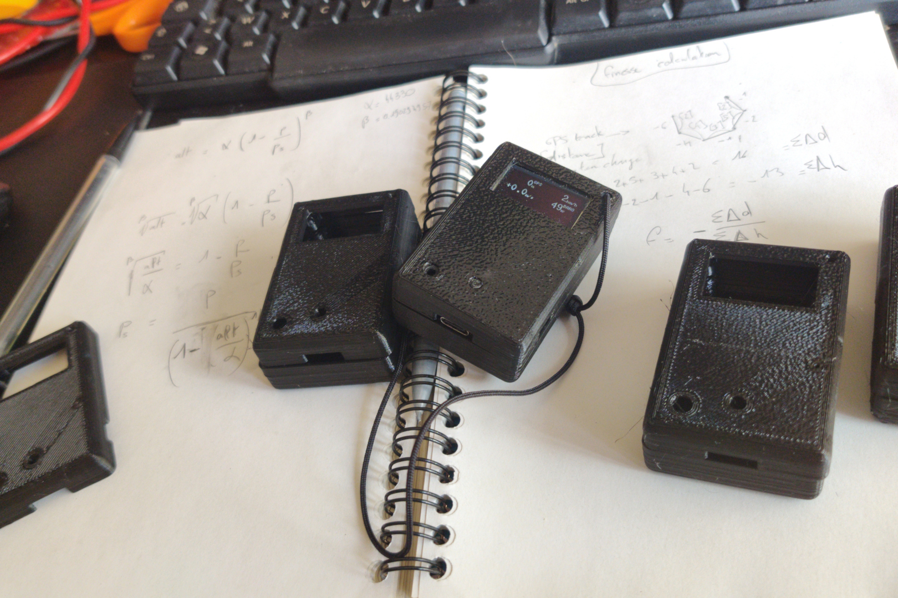
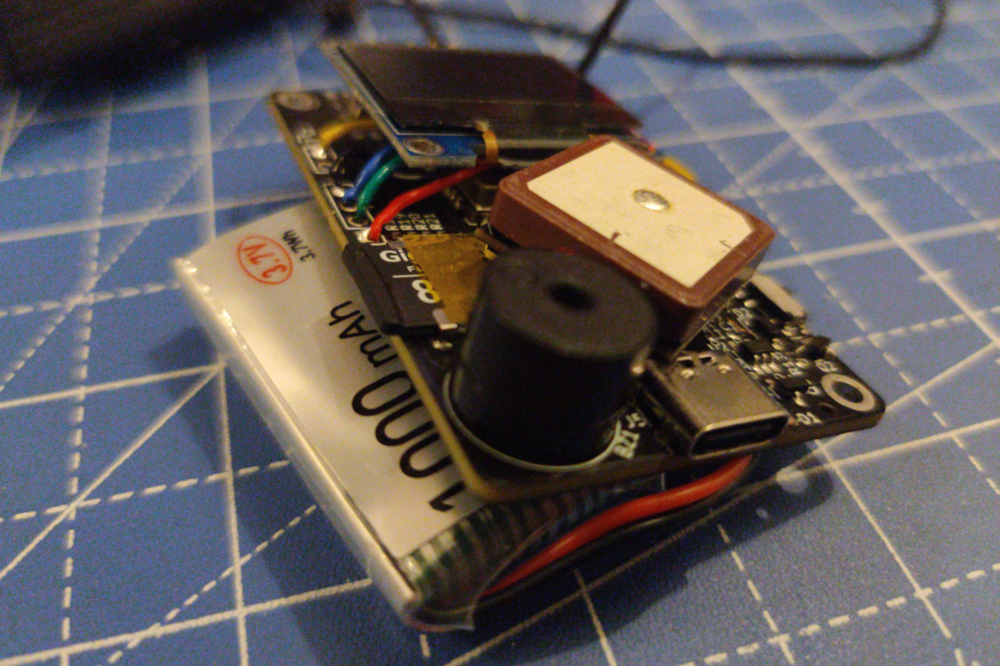
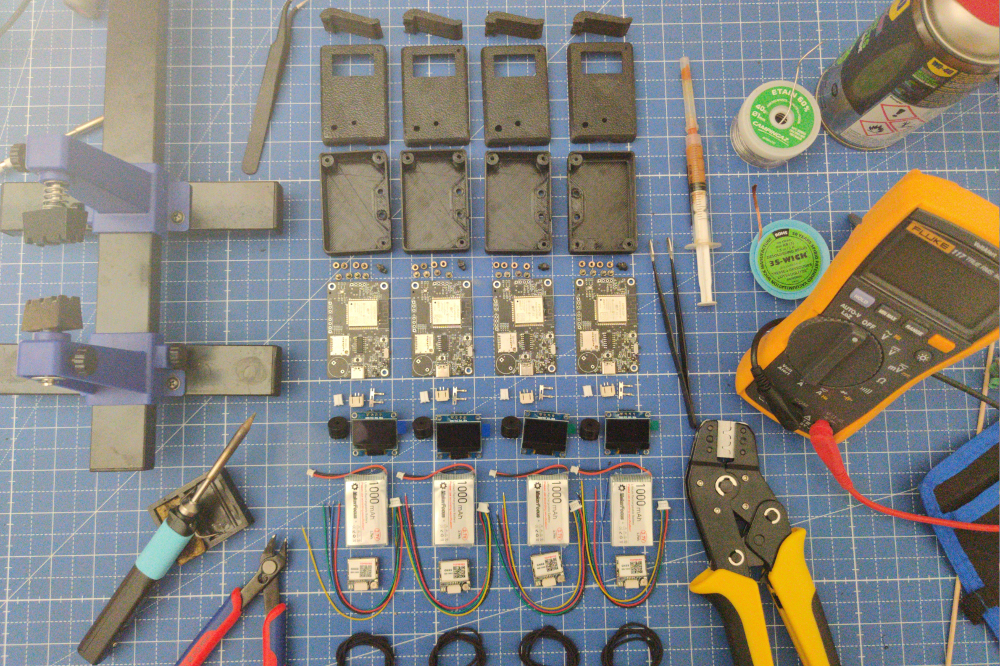

# crossometer-mini

This repo contains the design files for the crossometer-mini device, an open hardware GPS/altimeter/variometer using the [crossometer-firmware](https://github.com/fredszaq/crossometer-firmware).

Have a look at the [releases](https://github.com/fredszaq/crossometer-mini/releases) page to get the lastest release. Taking a look at open [issues](https://github.com/fredszaq/crossometer-mini/issues) may be a good idea if you intent do build a crossometer-mini for yourself.

Provided are the Kicad files for the PCB and the Freecad files for the enclosure and clip as well as the exported Gerber (can be used with J@LCPCB) and STL files

