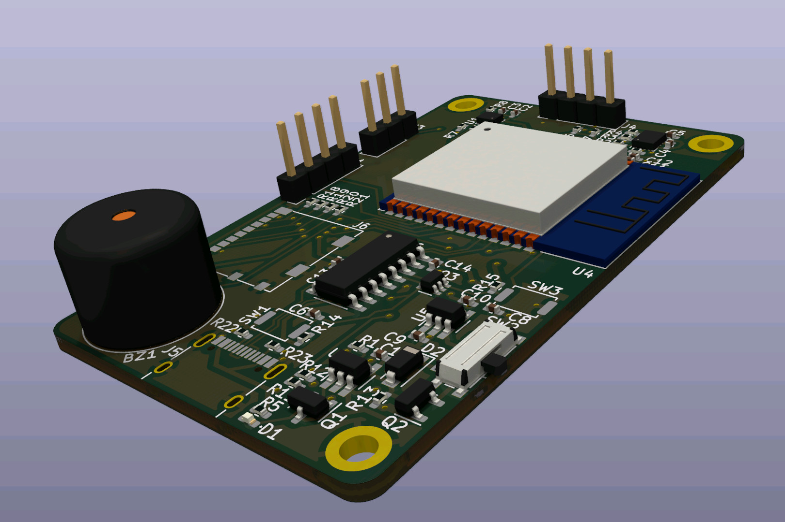

# crossometer-mini

This repo contains the design files for the crossometer-mini device, an open hardware GPS/altimeter/variometer using the [crossometer-firmware](https://github.com/fredszaq/crossometer-firmware).

Provided are the Kicad files for the PCB and the Freecad files for the enclosure and clip.

Taking a look at open [issues](https://github.com/fredszaq/crossometer-mini/issues) may be a good idea if you intent do build a crossometer-mini for yourself.

Have a look at the [releases](https://github.com/fredszaq/crossometer-mini/releases) page to get gerber files and STLs.

